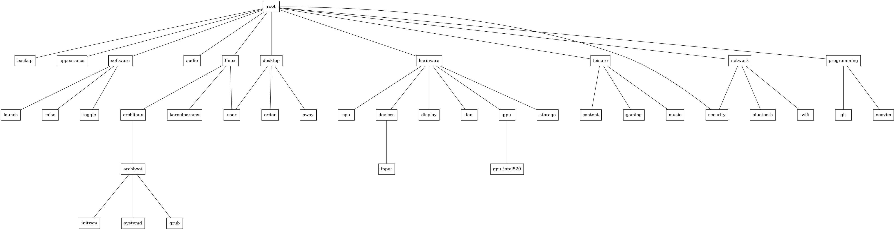

# backup

Backup user data using Borg
- Create and list backups 
- Get info from backups
- Check integrity

**TODO**: Delete and extract with fzf

# bluetooth

Interact with bluetooth using bluetoothctl and fzf

- Devices:
    - Connect
    - Disconnect 
    - Get info 
    - List 
    - Reconnect
- Restart bluetooth service
- Define names to assossiate a controller with a device

# control_menu

Emulate a start menu with fzf

- Run commands
- Read and edit files
- Navigate menus using fzf
- Search all referenced files with ripgrep
- Draw a graph of the menus structure
- Configure a menu using JSON
- Open specific menu by name with fish autocomplete
- Open last used menu

```
Format for the menu json file:
{
    "label": "",
    "menu": [ 
        {                   <- can be a recursive menu using the same format as this file
            "label": "",
            "direction": "", <- menu json name, must be in the menus_path
            "level"  <- if this menu goes up or down a level
        }
    ],
    "command": [
        {
            "label": "",
            "execute": "", <- command to execute on a bash shell
            "help": "" <- file path or string
        }
    ],
    "text": [
        {
            "label": "",
            "content": "" <- file path or string
        }
    ]
}
```




**TODO**: Finish debugging_graph function

# dunst_actions

- Run for every dunst notification
- Execute any command for each notification, like playing a custom sound
- Log the name of untreated notifications

# extract

Generic extraction function

# kb_auto_connect

Connect and configure my keyboard 

# launcher

Run .desktop files with gtk-launch

- fzf interface
- Cache file updated with a pacman hook or manually

**TODO**: Redo to make output fit the terminal like the twitch script. Redo how the cache is built.

# music

Handle music using mpd, fzf and waybar. Use together with mpc commands on sway.

- Search and play a song with fzf
- Show current cover if available
- Show information about a song and witch one is next
- Toggle lyrics on waybar with sptlrx
- Play a playslist or a external source, like a youtube video

# nvim_remote

Open a file in a existing neovim instance

# open_tui

Open directories on ranger instead of a GUI file manager

# shortcuts

List shortcuts files

**TODO**: This is old, do a menu instead.

# state_watcher

Watch and log the state of the home folder using inotifywait

- Keep track of applications that create directories and files on your home, local/share and config
- With thumbnail script: Keep track of videos to manage thumbnails

# sway_corners

**Sway only**

Move a floating window to a position using the numeric keypad as reference 

# sway_help

**Sway only**

Show modes shortcuts help on a notification

**TODO**: Create a centralized command configuration that this script can draw it's information automatically

# sway_init
**Sway only**

Commands to run at the start.

**TODO**: Do this on sway configuration instead (?).

# sway_layout
**Sway only**

Cycle through keyboard layouts

# sway_output
**Sway only**

Control displays on sway with fzf

- Change modes, scale, power, rotation
- Mirror screen with wl-mirror
- Create and remove a headless output to use VNC on it (use your phone as another screen)
- List and get information about connected displays
- Use an alias for the display name

**TODO**: Redo the command line parsing to allow multiple operations

# sway_sigkill
**Sway only**

Send SIGKILL to a window, with a notification message

# sway_ss
**Sway only**

Handle screenshots

- Full screenshots with grim
- Region screenshots with grim and slurp
- Edit region screenshots with grim, slurp and swappy
- Run OCR on a region and send to clipboard with grim, slurp, wl-clipboard and tesseract

# thumbnail_handler

Thumbnail support for videos

- Create, delete and move thumbnails of videos automatically
- Keep track of videos on a specific directory
- Open all thumbnails on vimv and use a custom keybind to open the related video on mpv

**TODO**: Fix configuration paths

# toggle

Toggle services, applications and configurations

**TODO**: Create a external file configuration instead of defining everything inside the script

# toggle_mic

Toggle mute the current input source on pulseaudio

# twitch

Simple twitch client

- List online 'following', with name, game, views and title
- Pick a stream to watch using fzf
- Open stream and chat using streamlink, mpv and chatterino
- A registered twitch application is necessary to use the API

# TODO scripts

- Generic command script to feed sway, kdeconnect, a mouse focused menu, help notification and a finder
- Simple ffmpeg wrapper video editor for trimming, gifs and converting formats
